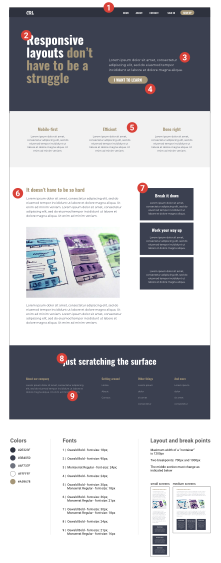
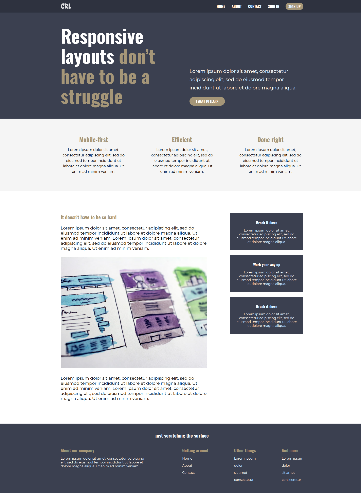
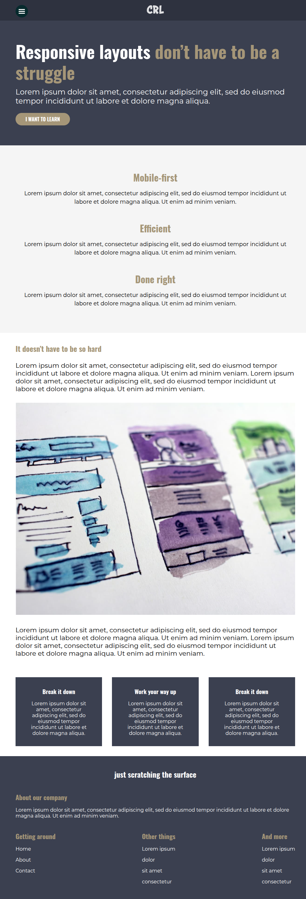
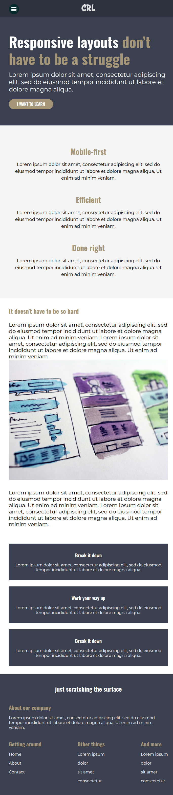

# Responsive Website Layouts

## [Live Demo](https://pbain63.github.io/website-by-responsive-layouts)

---

## Overview

This project demonstrates a fully responsive, mobile-first web layout using modern HTML and CSS best practices. It's designed to adapt seamlessly across devices—from smartphones to large desktop screens—while maintaining a clean, user-friendly interface.

The project is ideal for those learning how to:

- Create responsive layouts without frameworks
- Use semantic HTML5 tags
- Apply modern CSS (e.g., Flexbox, media queries)
- Follow accessibility and performance-friendly practices

---

## Screenshots

| Design Specs                                         | Desktop View                                    | Tablet View                                   | Mobile View                                   |
| ---------------------------------------------------- | ----------------------------------------------- | --------------------------------------------- | --------------------------------------------- |
|  |  |  |  |

---

## Technologies Used

- **HTML5** — semantic, accessible markup
- **CSS3** — Flexbox, media queries
- **Responsive Design Principles** — mobile-first, fluid layout
- **Git & GitHub** — version control and hosting via GitHub Pages

---

## Responsive Design Features

- **Mobile-first structure** with progressive enhancement for tablets and desktops
- **Navigation bar** that adapts to different screen widths
- **Section-based layout** with consistent spacing and hierarchy
- **Scalable text and images** for various resolutions

---

## Future Improvements

- Add JavaScript for interactivity (e.g., mobile menu toggle)
- Improve accessibility (ARIA roles, keyboard navigation)
- Convert to component-based structure using a framework like React
- Apply utility-first CSS approach (e.g., Tailwind CSS)

---

## Contributing

Contributions are welcome! If you spot bugs or have suggestions:

1. Fork the project
2. Create your feature branch (`git checkout -b feature/YourFeature`)
3. Commit your changes (`git commit -m 'Add your feature'`)
4. Push to the branch (`git push origin feature/YourFeature`)
5. Open a pull request

---

## License

This project is open source and available under the [MIT License](LICENSE).

---

Made with ❤ by [Prodip Bain](https://github.com/pbain63)

---
